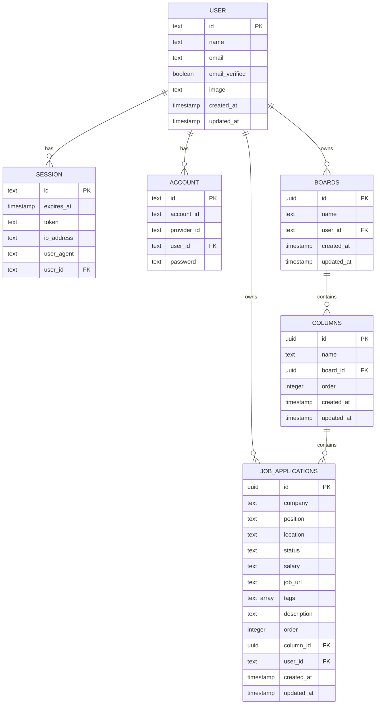

# Tapely

A visual, AI-assisted job application tracker. Every saved role, active application, and interview lives on one drag-and-drop board instead of scattered browser tabs and a spreadsheet nobody updates.

**Live demo:** Coming soon — currently running locally at `http://localhost:3000`

---

## Table of Contents

- [Overview](#overview)
- [Features](#features)
- [Tech Stack](#tech-stack)
- [Architecture](#architecture)
- [Database Schema](#database-schema)
- [Getting Started](#getting-started)
- [Project Structure](#project-structure)
- [Notable Engineering Decisions](#notable-engineering-decisions)
- [Roadmap](#roadmap)
- [Author](#author)

---

## Overview

Tapely is a kanban-style job application tracker built for people actively job hunting. Instead of maintaining a spreadsheet or losing track of applications across dozens of browser tabs, users track every stage of their job search — from a saved role to an accepted offer — on a single, customizable board.

The project started as a full rewrite: an early version was built on MongoDB with Mongoose, then migrated end-to-end to a relational schema on PostgreSQL with Drizzle ORM. That migration, and the debugging that came with it, shaped several of the decisions described below.

## Features

**Authentication**
- Email and password auth via `better-auth`
- Session-protected routes enforced at both the middleware layer (fast redirect) and the page level (actual authorization boundary)

**Board management**
- Kanban board with custom, user-defined columns (add, inline rename, delete)
- Deleting a column cascades its job applications automatically at the database level

**Job application tracking**
- Create, edit, and delete job applications with company, position, location, salary, tags, job posting URL, description, and personal notes
- Drag-and-drop reordering within a column and across columns, with persisted ordering
- Move an application between columns directly from its menu, without dragging

**AI-assisted entry**
- Paste a job posting URL or raw job description into the "Add Job" dialog
- A server-side route fetches and strips the page content (if a URL), then calls the Groq API (GPT-OSS 120B) to extract company, position, location, salary, tags, and a short description
- Extracted fields populate the form for review before saving — nothing is submitted without the user confirming it

**Design system**
- A cohesive visual identity built around a physical metaphor: a job application as an index card with a strip of colored tape marking its stage
- Shared ambient background component (animated grid and drifting color blobs) reused across the landing page, authentication screens, and the dashboard
- Custom two-panel authentication layout with a perforated "tear line" seam between the form and brand panel

## Tech Stack

| Layer | Technology |
|---|---|
| Framework | Next.js 16 (App Router, Server Components, Server Actions, Turbopack) |
| Language | TypeScript |
| Styling | Tailwind CSS v4, shadcn/ui components on Base UI primitives |
| Authentication | better-auth |
| ORM | Drizzle ORM |
| Database | PostgreSQL (Neon serverless) |
| Drag and drop | dnd-kit |
| AI extraction | Groq API (GPT-OSS 120B) |
| Icons | lucide-react |
| Fonts | Space Grotesk (display), Inter (body), Geist Mono (utility) — via `next/font/google` |

## Architecture

**Data fetching** happens in async Server Components. The dashboard page fetches the current user's board, including its columns and job applications, in a single nested Drizzle query — no client-side data fetching or loading spinners for the initial board render.

**Mutations** are handled through Server Actions (`'use server'`), not API routes. Every action re-verifies the session and, where relevant, re-verifies ownership of the resource being modified (a board, a column, a job application) before touching the database — the client-supplied IDs are only ever used for routing, never trusted for authorization.

**Route protection** is layered:
1. Middleware checks for a session before a protected route renders, redirecting unauthenticated requests immediately.
2. The page component itself re-checks the session before fetching any data.

This is intentional duplication: middleware is a fast, route-pattern-based first line of defense that protects any future route matching the pattern without additional code; the page-level check is the actual authorization boundary and cannot be bypassed the way an edge-layer check theoretically could be.

**Client state** for the board (columns and their job applications) is managed with a small custom hook (`useBoard`) that applies optimistic updates during drag-and-drop, then confirms the change with a Server Action. If the server rejects the change, the UI reflects the authoritative state on the next server round-trip.

## Database Schema



`job_applications` intentionally has no direct `board_id` column. A job application's board is always derived through its `column_id → columns.board_id` relationship. This was a deliberate normalization: an earlier version of the schema stored both `board_id` and `column_id` independently, which meant every move between columns had to keep two foreign keys in sync — a real source of data drift if any update path touched one field and not the other. Removing the redundant column made that entire class of bug impossible rather than something to remember to guard against.

Relations, as declared in Drizzle:

```typescript
export const boardRelations = relations(boards, ({ one, many }) => ({
  user: one(user, { fields: [boards.userId], references: [user.id] }),
  columns: many(columns),
}));

export const columnRelations = relations(columns, ({ one, many }) => ({
  board: one(boards, { fields: [columns.boardId], references: [boards.id] }),
  jobApplications: many(jobApplications),
}));

export const jobApplicationRelations = relations(jobApplications, ({ one }) => ({
  column: one(columns, { fields: [jobApplications.columnId], references: [columns.id] }),
  user: one(user, { fields: [jobApplications.userId], references: [user.id] }),
}));
```

## Getting Started

### Prerequisites
- Node.js 20 or later
- A PostgreSQL database (this project is built and tested against Neon's serverless Postgres)
- A Groq API key, for AI-assisted job entry

### Setup

```bash
git clone <repository-url>
cd job-tracker
npm install
```

Create a `.env` file in the project root:

```bash
DATABASE_URL=postgresql://<user>:<password>@<host>/<database>?sslmode=require
GROQ_API_KEY=gsk_...
BETTER_AUTH_SECRET=<a long random string>
BETTER_AUTH_URL=http://localhost:3000
```

Push the schema to your database:

```bash
npx drizzle-kit push
```

Run the development server:

```bash
npm run dev
```

Visit `http://localhost:3000`, sign up, and a default board with five starter columns (Wish List, Applied, Interviewing, Offer, Rejected) is created automatically for every new account.

### Optional: seed sample data

```bash
npm run seed:jobs
```

Update `USER_ID` in `scripts/seed.ts` to match the user you want to seed before running this.

## Project Structure

```
app/
  api/parse-job/        AI job-posting extraction endpoint
  dashboard/             Protected board view
  sign-in/, sign-up/     Authentication pages
  layout.tsx             Root layout, fonts, navbar
  page.tsx               Landing page

components/
  kanban-board.tsx        Board, columns, drag-and-drop context
  job-application-card.tsx
  create-job-dialog.tsx   Job creation form, including AI auto-fill
  create-column-dialog.tsx
  auth-shell.tsx          Shared two-panel auth layout
  ambient-background.tsx  Shared animated background, used across all pages
  board-skeleton.tsx      Loading state that mirrors the real board's layout
  logo.tsx                Brand mark, SVG, themed via CSS variables
  ui/                     shadcn/ui components (Base UI primitives)

db/
  schema/                 Drizzle table definitions and relations
  init-user-board.ts      Default board/column creation on sign-up
  index.ts                Database client

lib/
  actions/                Server Actions (job applications, columns)
  auth.ts                 better-auth configuration and session helper
  hooks/useBoards.ts       Client-side board state and optimistic drag-and-drop

proxy.ts                  Route-protection middleware
```

## Notable Engineering Decisions

A few things worth being able to speak to, since they came up as real problems during development rather than being designed upfront:

**Migrating from MongoDB to PostgreSQL.** The project was originally built on Mongoose with embedded document references (`Board.columns: ObjectId[]`, `Column.jobApplications: ObjectId[]`). Moving to Drizzle meant replacing those manually-maintained reference arrays with genuine foreign keys and `relations()` declarations, letting Postgres and the ORM handle referential integrity — including cascading deletes — instead of manual `$push`/`$pull` array bookkeeping.

**Drag-and-drop reordering.** Reordering uses a spaced-order scheme (multiples of 100 between sibling items) rather than sequential integers, so moving one card doesn't require rewriting the `order` value of every other card in a column — only the ones between the old and new position.

**A connection reliability issue.** Database queries intermittently failed with `ETIMEDOUT` despite the database being reachable (confirmed via raw TCP checks). The cause was Node's default preference for IPv6 address resolution when connecting to a host that offered both IPv6 and IPv4 addresses, where the IPv6 path was not actually reachable from the network in use. The fix was forcing IPv4-first resolution at the database client's module load time, before the connection pool is created.

**Choosing not to use an experimental caching feature.** An early version of the dashboard used Next.js's experimental Cache Components (`'use cache'`) on the board-fetching function. It introduced its own execution context that obscured underlying database errors behind a generic, unhelpful error message, and offered limited benefit for data that is per-user and mutated constantly. It was removed in favor of a plain Server Component fetch, which restored clear error messages and matched how frequently the underlying data actually changes.

**Layered route protection.** Middleware and page-level session checks both exist and serve different purposes, described in the Architecture section above — this was a deliberate choice after an early version relied on middleware alone, which turned out to log requests without actually blocking any of them.

## Roadmap

- Stale-application indicators (visual flag when a job hasn't moved in N days)
- Follow-up reminders tied to interview or deadline dates
- A funnel/conversion statistics view across all board stages
- Rate limiting on the AI extraction endpoint

## Author

**Shivam Jaiswal**

- LinkedIn: [add your LinkedIn profile link]
- Portfolio: [add your portfolio link]
